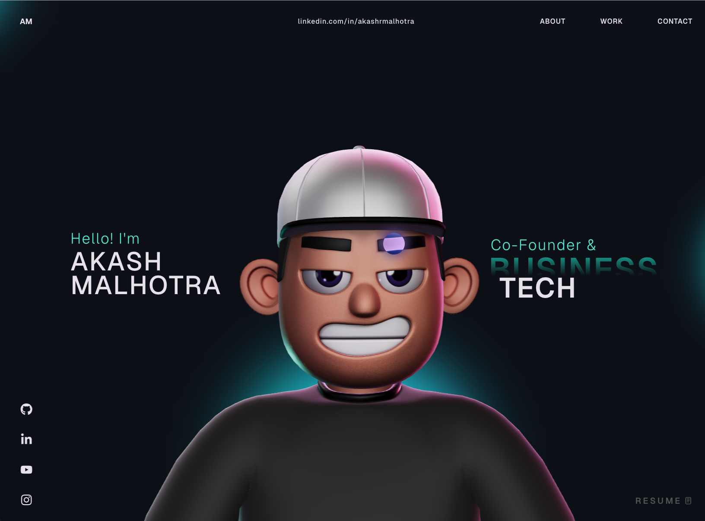

# Prakash KR. Arya — Personal Portfolio

**Live Site:** [prakashkumar.info](https://prakashkumar.info/)

A premium developer portfolio for **Prakash KR. Arya** — Freelance Web Developer, Full Stack Engineer, and SaaS Builder. Built for performance, conversion, and international freelance audiences.



---

## About

I'm a **Freelance Web Developer and Website Designer** based in India. I build premium SaaS experiences, interactive web applications, and custom automation systems for startups and businesses globally.

- 📧 **Email:** thekriyak@gmail.com
- 💼 **LinkedIn:** [linkedin.com/in/prakashkarya](https://www.linkedin.com/in/prakashkarya/)
- 🐙 **GitHub:** [github.com/prakash9142](https://github.com/prakash9142)
- 📱 **WhatsApp:** [wa.me/916205338520](https://wa.me/916205338520)
- 📸 **Instagram:** [@prakashhzero1](https://www.instagram.com/prakashhzero1)

---

## What's Included

- **Hero Section** — Animated role cycling (Freelance Web Developer, Full Stack Developer, SaaS MVP Builder, AI & Automation Expert), CTA buttons, resume download, and 3D visual anchor.
- **About Section** — Timeline storytelling: CS Graduate (2025), Full Stack Developer at AVACS, and Freelance Developer since 2024.
- **Skills Section** — Interactive physics sandbox and terminal chatbot showcasing React, Next.js, TypeScript, Node.js, MongoDB, PostgreSQL, Docker, and more.
- **Experience Section** — AVACS Full Stack Developer role with metrics: +40% faster product load times, 3+ major integrations shipped.
- **Projects Section** — Live project showcases with HUD modals:
  - **Booon Fashion** — E-commerce storefront (React, Laravel, PostgreSQL, Razorpay)
  - **Elevate Data Corp** — Digital marketing website (React, Tailwind, MongoDB)
  - **Boncel Pharma** — Pharmaceutical e-commerce (React, Tailwind, Razorpay SDK)
  - **AVACS Platform** — Enterprise corporate interface (React, Node.js)
  - **Company CRM Tool** — Internal CRM for attendance tracking and lead management
- **Services Section** — Freelance packages: Web Design & Dev (from ₹39,999), SaaS MVP (from ₹1,19,999), UI/UX Design (from ₹24,999), Automation & APIs (from ₹29,999).
- **FAQ Section** — Pricing, payment methods (UPI, Razorpay, Bank Transfer), timelines, and tech stack Q&A.
- **Contact Section** — Email, WhatsApp, GitHub, LinkedIn, and resume CTA with an integrated contact form.
- **Design** — Dark glassmorphism, particle motion, cursor glow, and responsive UX across all devices.

---

## Tech Stack

| Layer | Technology |
|-------|-----------|
| Frontend | React 18, TypeScript, Tailwind CSS |
| Animation | Framer Motion, GSAP |
| 3D | Three.js, React Three Fiber |
| Icons | React Icons |
| Build | Vite |
| Backend | Node.js, Express |
| Email | Nodemailer |
| Deployment | Vercel / Hostinger |

---

## Project Structure

```text
src/
├── components/
│   ├── Character/               # 3D scene and render utilities
│   ├── sections/                # Page sections
│   │   ├── AboutSection.tsx
│   │   ├── ContactSection.tsx
│   │   ├── ExperienceSection.tsx
│   │   ├── FAQSection.tsx
│   │   ├── Hero.tsx
│   │   ├── ProjectsSection.tsx
│   │   ├── ServicesSection.tsx
│   │   ├── SkillsSection.tsx
│   │   ├── TestimonialsSection.tsx
│   │   └── SectionHeading.tsx
│   ├── FloatingParticles.tsx    # Ambient motion layer
│   ├── Navbar.tsx
│   ├── Cursor.tsx
│   ├── SocialIcons.tsx
│   └── MainContainer.tsx        # Application shell
├── data/
│   └── portfolioData.ts         # All site content (edit here to update)
├── App.tsx
├── App.css
├── index.css
└── main.tsx
```

---

## Design System

### Color Palette

| Token | Value |
|-------|-------|
| Primary accent | `#5de8d2` |
| Secondary accent | `#7f7cff` |
| Surface | `rgba(11, 17, 35, 0.9)` |
| Text | `#e5e7f0` |
| Muted | `#8892b0` |
| Background | `#050814` |

### Typography

- **Primary Font:** Inter
- Hero: large display type
- Sections: clean headings
- Body: compact readable text

### Animations

- **Framer Motion** for section reveals and micro-interactions
- **GSAP** for scroll-linked animations
- **CSS particles** for ambient premium polish
- **Physics canvas** in Skills section (elastic bubble collisions)

---

## Getting Started

### Prerequisites

- Node.js 18+
- npm 9+

### Install

```bash
npm install
```

### Run locally

```bash
npm run dev
```

### Build

```bash
npm run build
```

### Preview production build

```bash
npm run preview
```

---

## Deployment

### Vercel

1. Push this repository to GitHub.
2. Create a new project in Vercel and link the repository.
3. Use default Vite settings.
4. Deploy and verify the live URL.

### Hostinger (Node.js)

1. Upload the project to Hostinger.
2. Set entry point: `server.js`.
3. Run `npm install` — the `postinstall` script auto-builds the project.
4. Set environment variables (`SMTP_USER`, `SMTP_PASS`, `CONTACT_EMAIL`) in Hostinger's Node.js panel.

---

## Content Customization

All portfolio content is centralized in [`src/data/portfolioData.ts`](src/data/portfolioData.ts):

- **`heroData`** — Name, title, roles, email, WhatsApp
- **`aboutData`** — Description, highlights, career timeline
- **`skillGroups`** — Frontend, Backend, Database, and Tools skill levels
- **`experienceData`** — Company, role, duration, impact, metrics
- **`projectsData`** — Project cards with stack, features, links, and images
- **`servicesData`** — Freelance service packages and pricing
- **`faqData`** — FAQ questions and answers
- **`testimonialsData`** — Client testimonial quotes
- **`navLinks`** — Navigation menu links
- **`socialLinks`** — Social media profile links

---

## Environment Variables

Create a `.env` file in the root:

```env
SMTP_USER=your_email@gmail.com
SMTP_PASS=your_app_password
CONTACT_EMAIL=your_receive_email@gmail.com
PORT=3000
```

---

## SEO

- Canonical URL: `https://prakashkumar.info/`
- Open Graph and Twitter card meta tags configured
- Schema markup for Person and Service
- `robots.txt` and `sitemap.xml` included
- Google Search Console verification file included

---

## License

This project is open source under the [MIT License](LICENSE).

---

*Built by [Prakash KR. Arya](https://prakashkumar.info/) — Freelance Web Developer & Website Designer*
